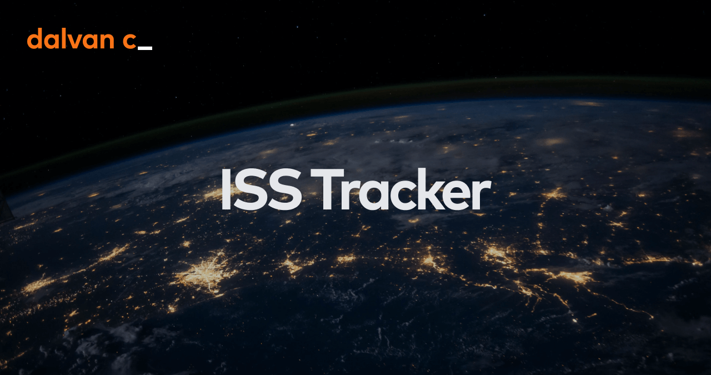

# International Space Station (ISS) Tracker

  

## About

The **International Space Station (ISS) Tracker** is a simple vanilla JavaScript web application that tracks the real-time location of the ISS using a fetch call to a [publicly available API](https://wheretheiss.at/w/developer) and displays this location on an interactive map powered by [Leaflet](https://leafletjs.com/) and [Google](https://about.google/). Special thanks to [The Coding Train](https://thecodingtrain.com/) for the core concept that served as a foundation for this project.

## Features

- Real-time tracking of the International Space Station.
- Interactive map interface using Leaflet to display ISS location.
- Updated data every second.
- User-friendly and responsive design for easy use on various devices.

## Usage

- The ISS Tracker will automatically fetch the ISS's current information and display its position on the map.
- You can zoom in, pan, and explore the map to track the ISS in real time.

## Demo

Check out the live demo of the ISS Tracker [here](https://iss.dalvanc.com/).

## Contact

If you have any questions or suggestions, please feel free to contact me at [contact@dalvanc.com](mailto:contact@dalvanc.com).

## License

This project is licensed under the **MIT license**. You can read the full license by clicking on the link below:

**[📄 MIT License - ISS Tracker](./LICENSE)**

&copy; 2024 **Dalvan Carvalho**
